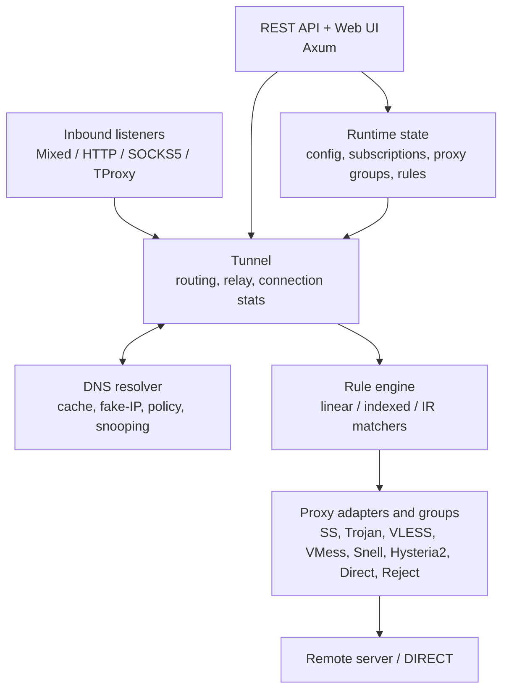

# meow-rs

A high-performance Rust implementation of the [mihomo](https://github.com/MetaCubeX/mihomo) (Clash Meta) proxy kernel. Rule-based tunneling with support for multiple proxy protocols, transparent proxy, DNS snooping, a REST API, and a built-in web dashboard.

## Features

### Proxy Protocols
- **Shadowsocks** -- TCP and UDP relay, AEAD and stream ciphers (aes-256-gcm, chacha20-ietf-poly1305, etc.)
- **Trojan** -- TLS 1.2/1.3 via rustls, SNI, optional skip-cert-verify
- **Hysteria2** -- QUIC-based TCP and UDP relay, Salamander obfs, port hopping, down bandwidth auth hint, SNI, skip-cert-verify, and certificate pinning
- **VLESS** -- Plain VLESS and XTLS-Vision splice; TLS, WebSocket, gRPC, H2, HTTPUpgrade transports
- **VMess** -- AEAD VMess outbound with TCP/WebSocket transports
- **HTTP** -- HTTP CONNECT outbound proxy with optional TLS and basic auth
- **SOCKS5** -- SOCKS5 outbound proxy with optional TLS and auth
- **Snell** -- v3/v4/v5 TCP, UDP-over-TCP, optional HTTP/TLS obfs; v4/v5 connection reuse
- **AnyTLS** -- Optional AnyTLS outbound (`anytls` feature)
- **Direct** -- Direct connection to destination
- **Reject** -- Drop connections (with configurable behavior)

### TLS & Privacy
- **ECH (Encrypted Client Hello)** -- DNS-based ECH config fetching from HTTPS/SVCB records; BoringSSL backend (`boring-tls` feature)
- **uTLS Fingerprinting** -- Chrome, Firefox, Safari, iOS, Android, Edge profiles to bypass TLS fingerprint detection
- **rustls** default backend with optional BoringSSL for advanced features

### Proxy Groups
- **Selector** -- Manual proxy selection via REST API or web UI
- **URLTest** -- Automatic selection based on latency with tolerance threshold
- **Fallback** -- Automatic failover to first alive proxy
- **LoadBalance** -- Round-robin or consistent-hashing distribution
- **Relay** -- Chained proxy tunneling through multiple hops

### Rule Engine
| Rule | Example | Description |
|------|---------|-------------|
| DOMAIN | `DOMAIN,google.com,Proxy` | Exact domain match |
| DOMAIN-SUFFIX | `DOMAIN-SUFFIX,google.com,Proxy` | Domain and subdomains |
| DOMAIN-KEYWORD | `DOMAIN-KEYWORD,google,Proxy` | Substring match |
| DOMAIN-REGEX | `DOMAIN-REGEX,^ads?\.,Proxy` | Regex pattern |
| DOMAIN-WILDCARD | `DOMAIN-WILDCARD,*.example.com,Proxy` | Wildcard domain pattern |
| IP-CIDR | `IP-CIDR,10.0.0.0/8,DIRECT,no-resolve` | Destination IP range |
| IP-SUFFIX | `IP-SUFFIX,0.0.0.1/8,Proxy` | Destination IP suffix bits |
| SRC-IP-CIDR | `SRC-IP-CIDR,192.168.0.0/16,DIRECT` | Source IP range |
| SRC-GEOIP | `SRC-GEOIP,CN,DIRECT` | Source GeoIP lookup |
| IP-ASN | `IP-ASN,15169,Proxy` | Destination ASN lookup |
| DST-PORT | `DST-PORT,80,443,8080,Proxy` | Destination port(s) |
| SRC-PORT | `SRC-PORT,1234,DIRECT` | Source port(s) |
| NETWORK | `NETWORK,udp,Proxy` | TCP or UDP |
| PROCESS-NAME | `PROCESS-NAME,curl,DIRECT` | Process name |
| PROCESS-PATH | `PROCESS-PATH,/usr/bin/curl,DIRECT` | Process path |
| GEOIP | `GEOIP,CN,DIRECT,no-resolve` | MaxMind GeoIP lookup |
| GEOSITE | `GEOSITE,cn,DIRECT` | MetaCubeX `.mrs` geosite database |
| RULE-SET | `RULE-SET,ads,REJECT` | Rule provider lookup |
| DSCP | `DSCP,46,Proxy` | IP DSCP field |
| IN-PORT | `IN-PORT,7890,Proxy` | Inbound listener port |
| IN-NAME | `IN-NAME,mixed,Proxy` | Inbound listener name |
| IN-TYPE | `IN-TYPE,SOCKS5,Proxy` | Inbound listener protocol |
| IN-USER | `IN-USER,alice,Proxy` | Authenticated inbound user |
| UID | `UID,1000,DIRECT` | Process UID (Linux) |
| SUB-RULE | `SUB-RULE,LOCAL-BYPASS` | Named rule subset |
| MATCH | `MATCH,Proxy` | Catch-all fallback |

Logic composition rules (AND, OR, NOT) are also supported for combining conditions.

### DNS
- UDP DNS server with configurable listen address
- Main + fallback nameserver groups
- Response caching and in-flight request deduplication
- **DNS snooping** -- reverse IP→domain lookup table for transparent proxy hostname recovery

### Inbound Listeners
- **Mixed** -- Auto-detects HTTP or SOCKS5 on a single port
- **HTTP Proxy** -- HTTP CONNECT and plain HTTP forwarding
- **SOCKS5** -- SOCKS5 with optional authentication
- **Transparent Proxy (TProxy)** -- Kernel-level traffic interception via nftables (Linux) or pf (macOS)

### Transparent Proxy
Intercept all local TCP traffic at the kernel firewall level without per-app proxy configuration.

- **nftables** redirect on Linux, **pf** anchor on macOS
- **Loop avoidance**: SO_MARK on outbound DIRECT sockets (Linux), UID-based bypass (macOS), plus IP bypass for upstream proxy servers
- **SNI extraction**: Peek at TLS ClientHello to recover hostname for HTTPS traffic
- **DNS snooping**: Reverse IP→domain lookup from recent DNS queries for non-TLS traffic
- **RAII firewall guard**: Rules automatically cleaned up on shutdown (SIGINT/SIGTERM)
- Configurable via `tproxy-port`, `routing-mark`, and `tproxy-sni` in YAML

The built-in firewall transparently proxies the **host's own** traffic. To build a **LAN gateway** that forwards and proxies *other* devices' traffic, see [docs/tproxy-gateway.md](docs/tproxy-gateway.md).

### Web Dashboard

Built-in web UI served at `http://<api-addr>/ui` with:

- **Overview** -- Mode selector, listening ports, live traffic stats
- **Proxies** -- Click-to-switch selector groups, view all proxy group members
- **Subscriptions** -- Add/refresh/delete Clash YAML subscription URLs (auto-cached to disk)
- **Proxy Groups** -- Create/edit/delete selector, url-test, fallback groups
- **Rules** -- Add/delete/reorder rules with drag-and-drop, search/filter

### Subscription Management
- Fetch and import Clash YAML subscriptions (proxies, groups, rules)
- Auto-save to disk -- cached data loads on restart without re-fetching
- Background refresh on configurable intervals
- Multi-pass group resolution for inter-group references

### REST API
| Endpoint | Method | Description |
|----------|--------|-------------|
| `/version` | GET | Version info |
| `/proxies` | GET | List all proxies |
| `/proxies/{name}` | GET/PUT | Get or switch proxy |
| `/proxies/{name}/delay` | GET | Run an on-demand delay probe |
| `/group/{name}/delay` | GET | Run a group delay probe |
| `/rules` | GET/POST/PUT | List, replace, or update rules |
| `/rules/{index}` | DELETE | Delete rule at index |
| `/rules/reorder` | POST | Reorder rules |
| `/connections` | GET | Active connections with traffic stats |
| `/connections` | DELETE | Close all active connections |
| `/connections/{id}` | DELETE | Close a connection |
| `/configs` | GET/PATCH/PUT | Get config, patch mode, or reload config |
| `/traffic` | GET | Upload/download statistics |
| `/logs` | GET (WS) | Runtime log stream |
| `/memory` | GET (WS) | Runtime memory stream |
| `/metrics` | GET | Prometheus metrics |
| `/dns/query` | GET/POST | Direct DNS query |
| `/cache/dns/flush` | POST | Flush DNS cache |
| `/cache/fakeip/flush` | POST | Flush fake-IP mappings |
| `/listeners` | GET | List configured named listeners |
| `/providers/proxies` | GET | List proxy providers |
| `/providers/proxies/{name}` | GET/PUT | Get or refresh a proxy provider |
| `/providers/proxies/{name}/healthcheck` | GET | Run provider health check |
| `/providers/rules` | GET | List rule providers |
| `/providers/rules/{name}` | GET/PUT | Get or refresh a rule provider |
| `/api/config/save` | POST | Save running config to disk |
| `/api/subscriptions` | GET/POST | List or add subscriptions |
| `/api/subscriptions/{name}` | DELETE | Delete subscription |
| `/api/subscriptions/{name}/refresh` | POST | Refresh subscription |
| `/api/proxy-groups` | GET/POST | List or create proxy groups |
| `/api/proxy-groups/{name}` | PUT/DELETE | Update or delete proxy group |
| `/api/proxy-groups/{name}/select` | PUT | Switch selector proxy |
| `/ui` | GET | Web dashboard |

### Tunnel
- Three routing modes: **Rule**, **Global**, **Direct**
- Bidirectional TCP relay and UDP NAT session tracking
- Per-connection traffic statistics with connection lifecycle management

## Benchmarks

Side-by-side against upstream Go mihomo v1.19.27 on the same host (Apple Silicon arm64, macOS 26.4.1, loopback `127.0.0.1`). Both binaries use identical config: `mode: direct`, SOCKS5 listener on port 17890, DNS disabled. Reproduce with `bash bench.sh` (auto-downloads the latest Go mihomo release).

| Metric | mihomo (Go) | meow-rs v0.14.0 | Delta |
|--------|-------------|--------------------|-------|
| Binary size (stripped) | 40.7 MB | **7.2 MB** | **−82%** |
| RSS idle | 30.8 MB | **9.7 MB** | **−69%** |
| RSS under load (peak) | 30.8 MB | **9.7 MB** | **−69%** |
| TCP throughput, 64 MB×1 | 5.15 Gbps | **5.23 Gbps** | **+2%** |
| TCP throughput, 1 MB×10 | 4.62 Gbps | 4.15 Gbps | −10% |
| TCP throughput, 4 KB×10000 | 0.92 Gbps | 0.90 Gbps | −2% |
| Latency p50 (connect + 1 B echo) | 257 µs | 258 µs | ±0% |
| Latency p99 | 332 µs | 354 µs | +7% |
| Connections/sec (10 s, concurrency 64) | 709 /s | 710 /s | ±0% |

Single-run results from `bash bench.sh`; numbers will vary with host load. For the full methodology, three-run-median protocol, and workload definitions (W1–W5), see [ADR-0006](docs/adr/0006-m2-benchmark-methodology.md) and [docs/benchmarks/index.md](docs/benchmarks/index.md).

## Architecture



11 workspace crates with clear separation of concerns:

| Crate | Purpose |
|-------|---------|
| `meow-common` | Core traits and types (ProxyAdapter, Rule, Metadata) |
| `meow-trie` | Domain trie for efficient pattern matching |
| `meow-transport` | TLS (rustls + BoringSSL), WebSocket, gRPC, H2, HTTPUpgrade layers |
| `meow-proxy` | Proxy protocol implementations and groups |
| `meow-rules` | Rule matching engine and parser |
| `meow-dns` | DNS resolver, cache, DNS snooping, server |
| `meow-tunnel` | Core routing, TCP/UDP relay, statistics |
| `meow-listener` | Inbound protocol handlers (Mixed/HTTP/SOCKS5/TProxy) |
| `meow-config` | YAML configuration parsing, subscription fetcher, config persistence |
| `meow-api` | REST API (Axum) + embedded web UI |
| `meow-app` | CLI entry point |

## Quick Start

### Build

Requires Rust 1.88+ (the workspace pins `rust-version = "1.88"` and CI enforces it via a dedicated MSRV job).

```bash
cargo build --release
```

### Run

```bash
# Copy the example config and edit it
cp config.example.yaml config.yaml
# Edit config.yaml with your proxy servers...

# Run
./target/release/meow -f config.yaml

# Test config validity
./target/release/meow -f config.yaml -t
```

### Install as system service

**Linux (systemd):**

```bash
sudo ./target/release/meow install -f /path/to/config.yaml

# Manage the service
sudo systemctl status meow
sudo systemctl restart meow
sudo journalctl -u meow -f

# Uninstall
sudo ./target/release/meow uninstall
```

**macOS (launchd user agent):**

```bash
./target/release/meow install -f /path/to/config.yaml

# Config is copied to ~/Library/Application Support/meow/config.yaml
# Logs are written to ~/Library/Logs/meow/

# Check status
./target/release/meow status

# View logs
tail -f ~/Library/Logs/meow/meow.log

# Uninstall
./target/release/meow uninstall
```

**OpenWrt (opkg + LuCI):**

Official `.ipk` packages for arm/aarch64 routers — including a
`luci-app-meow` that embeds the built-in web panel in LuCI — are attached
to every [release](https://github.com/madeye/meow-rs/releases). See
[docs/openwrt.md](docs/openwrt.md).

### Open the Web UI

After starting, open your browser to:

```
http://127.0.0.1:9090/ui
```

From the **Subscriptions** tab you can add a Clash subscription URL to import proxies, groups, and rules automatically.

### Use the Proxy

```bash
# HTTP proxy
curl --proxy http://127.0.0.1:7890 https://ipinfo.io

# SOCKS5 proxy
curl --proxy socks5://127.0.0.1:7890 https://ipinfo.io

# Set as system proxy (macOS)
export https_proxy=http://127.0.0.1:7890
export http_proxy=http://127.0.0.1:7890
```

### Example Configuration

```yaml
mixed-port: 7890
mode: rule
log-level: info

# Transparent proxy (requires root/sudo)
# tproxy-port: 7893
# tproxy-sni: true
# routing-mark: 9527

external-controller: 127.0.0.1:9090

dns:
  enable: true
  listen: 127.0.0.1:1053
  nameserver:
    - 8.8.8.8
  fallback:
    - 8.8.4.4

proxies:
  - name: my-ss
    type: ss
    server: 1.2.3.4
    port: 8388
    cipher: aes-256-gcm
    password: "secret"
    udp: true

  - name: my-trojan
    type: trojan
    server: 5.6.7.8
    port: 443
    password: "secret"
    sni: example.com
    skip-cert-verify: false

  - name: my-snell
    type: snell
    server: ss.example.com
    port: 8443
    psk: "your-psk"
    version: 3
    udp: true
    obfs-opts:
      mode: http
      host: /

  - name: my-hy2
    type: hysteria2
    server: hy2.example.com
    port: 443
    ports: "443,8443-8445"
    hop-interval: 30
    password: "secret"
    sni: hy2.example.com
    skip-cert-verify: false
    udp: true
    up: "100 Mbps"
    down: "100 Mbps"
    obfs: salamander
    obfs-password: "obfs-secret"

proxy-groups:
  - name: Proxy
    type: select
    proxies: [my-ss, my-trojan, my-snell, my-hy2]

  - name: Auto
    type: url-test
    proxies: [my-ss, my-trojan, my-snell, my-hy2]
    url: http://www.gstatic.com/generate_204
    interval: 300

rules:
  - DOMAIN-SUFFIX,local,DIRECT
  - IP-CIDR,127.0.0.0/8,DIRECT,no-resolve
  - IP-CIDR,192.168.0.0/16,DIRECT,no-resolve
  - DOMAIN-SUFFIX,google.com,Proxy
  - MATCH,Proxy
```

See [`config.example.yaml`](config.example.yaml) for a full annotated example.

## Testing

```bash
# All unit tests
cargo test --lib

# Rules tests (78 tests covering all rule types)
cargo test --test rules_test

# API and config persistence tests (54 tests)
cargo test --test api_test
cargo test --test config_persistence_test

# Trojan integration tests (embedded mock server, no external deps)
cargo test --test trojan_integration

# Hysteria2 Docker integration tests (requires Docker)
MEOW_REQUIRE_DOCKER=1 cargo test -p meow-proxy --features hysteria2 --test hysteria2_integration -- --nocapture

# Shadowsocks integration tests (requires ssserver)
cargo install shadowsocks-rust --features "stream-cipher aead-cipher-2022" --locked
cargo test --test shadowsocks_integration

# Transparent proxy end-to-end tests (requires Docker)
bash tests/test_tproxy_qemu.sh
```

## License

MIT — Copyright (c) 2026 Max Lv. See [LICENSE](LICENSE).
